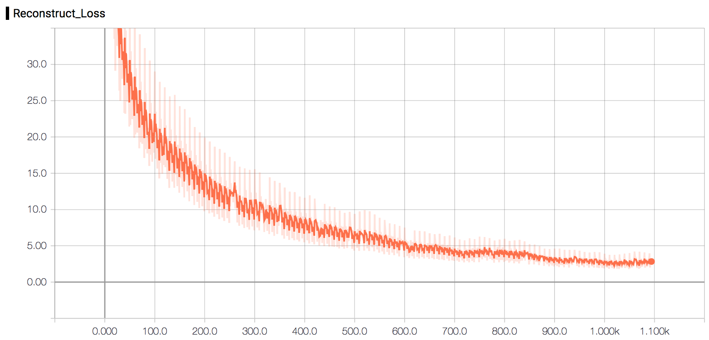
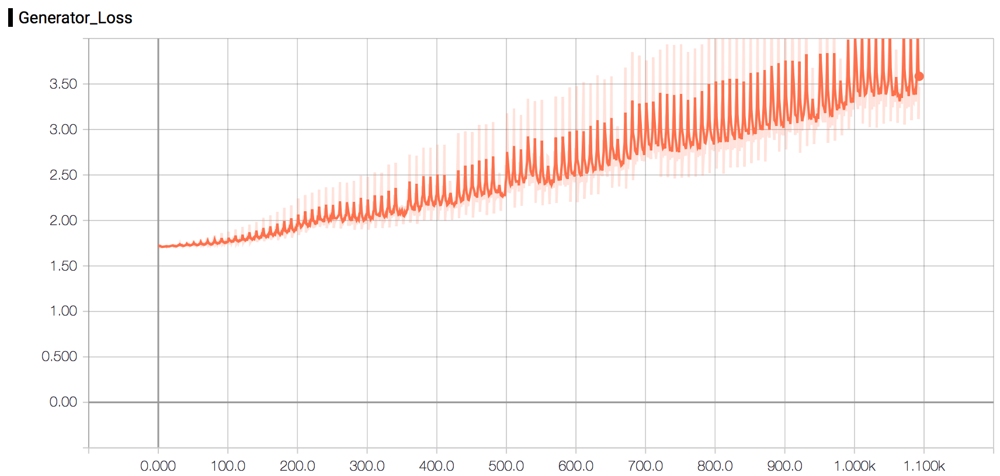
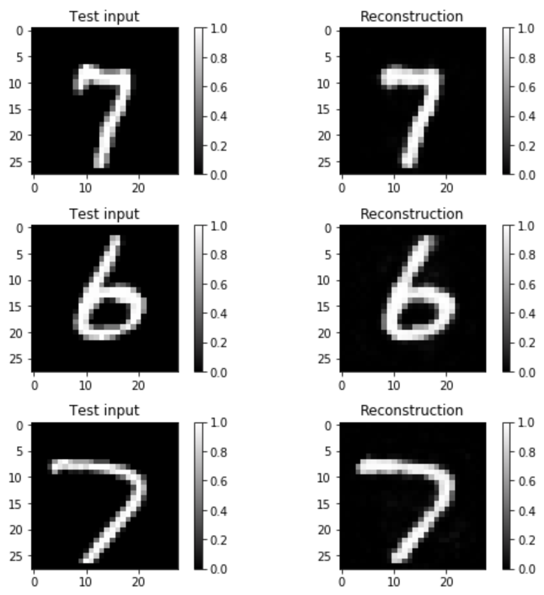
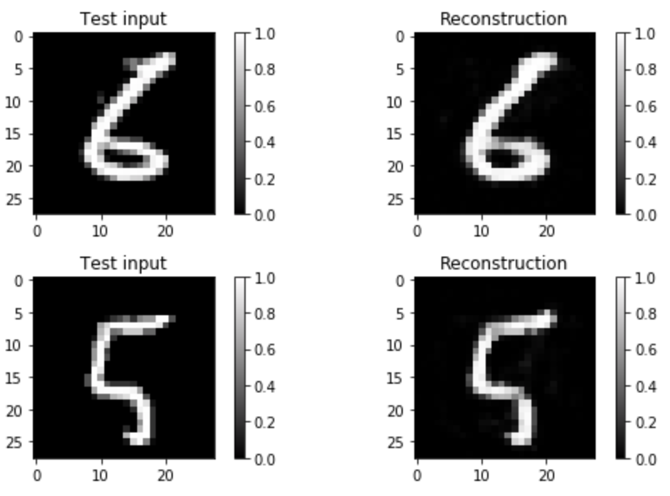
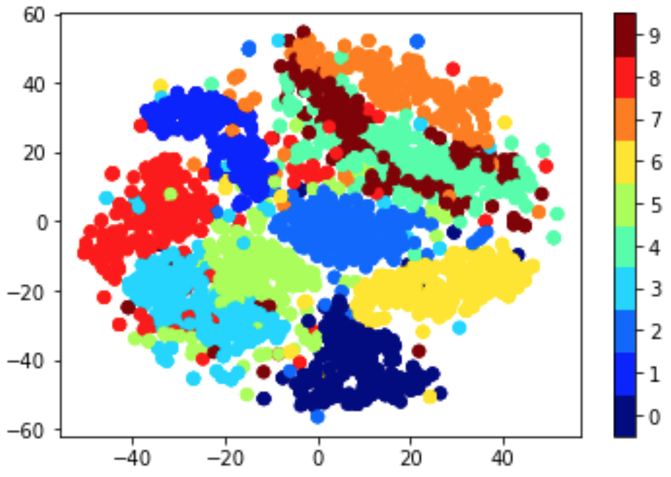

# Advesarial Autoencoder (AAE) by using tensorflow


Reference
----------

[Adversarial Autoencoders](https://arxiv.org/abs/1511.05644) proposed by Ian Goodfellow et la. in 2016


Usage
-----

To train a model

	$ python run.py --mode=train --num_epochs=100 --plot

All options
```
usage: run.py [-h] [--num_epochs NUM_EPOCHS] [--num_classes NUM_CLASSES]
              [--G_type G_TYPE] [--batch_size BATCH_SIZE] [--z_dim Z_DIM]
              [--learning_rate LEARNING_RATE] [--data_dir DATA_DIR]
              [--summary_dir SUMMARY_DIR] --mode MODE [--shuffle] [--plot]

optional arguments:
  -h, --help            show this help message and exit
  --num_epochs NUM_EPOCHS
                        Specify number of epochs
  --num_classes NUM_CLASSES
                        Specify number of classes
  --G_type G_TYPE       Specify the type of Generator Loss
  --batch_size BATCH_SIZE
                        Batch size. Must divide evenly into the dataset sizes.
  --z_dim Z_DIM         Specify the dimension of the latent space
  --learning_rate LEARNING_RATE
                        Specify learning rate
  --data_dir DATA_DIR   Specify the directory of data
  --summary_dir SUMMARY_DIR
                        Specify the directory of summaries
  --mode MODE           Specify mode: `train` or `eval`
  --shuffle             Whether shuffle the data or not
  --plot                Plot the t-sne, reconstructed images and generated
                        images
```


Losses & Reconstruction
-----------------------

Training for 100+ epochs ...

### VAE Loss  (Using Adam optimizer)




### Discriminator Loss  (Using Adam optimizer)


### Generator Loss  (Using Adam optimizer)




### Reconstructed MNIST images






### T-SNE of the lantent space



